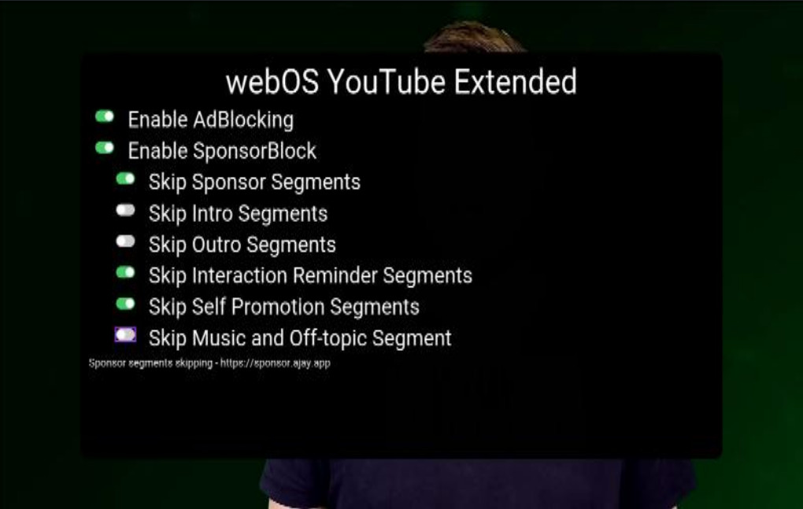
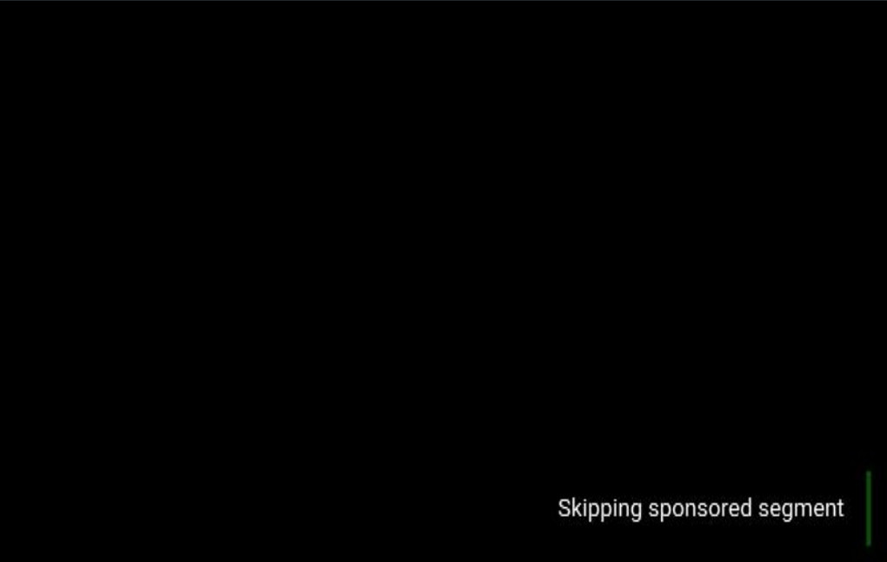
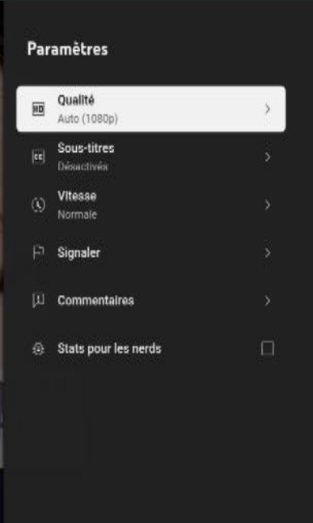

# youtube-webos-cobalt

YouTube App built with [Cobalt](https://cobalt.googlesource.com/cobalt/) with extended functionalities.

This project is built on top of [youtube-webos](https://github.com/webosbrew/youtube-webos).

Cobalt [only support a subset of HTML tags](https://cobalt.dev/development/reference/supported-features.html),
youtube-webos had to be reworked to only use `div` tag.





## Features

Same as the default youtube application:
- Speed management

Same as youtube-webos:
- Advertisements blocking
- [SponsorBlock](https://sponsor.ajay.app/) integration
- [Autostart](#autostart)


**Note:** Configuration screen can be opened by pressing 🟩 GREEN button on the remote.

## Pre-requisites

- Official YouTube app needs to be uninstalled before installation.

## Installation

- Use [webOS Homebrew Channel](https://github.com/webosbrew/webos-homebrew-channel) - app is published in official webosbrew repo
- Use [Device Manager app](https://github.com/webosbrew/dev-manager-desktop) - see [Releases](https://github.com/webosbrew/youtube-webos/releases) for a
  prebuilt `.ipk` binary file
- Use official webOS/webOS OSE SDK: `ares-install youtube...ipk` (for webOS SDK configuration
  see below)

## Configuration

Configuration screen can be opened by pressing 🟩 GREEN button on the remote.

### Autostart

In order to autostart an application the following command needs to be executed
via SSH or Telnet:

```sh
luna-send-pub -n 1 'luna://com.webos.service.eim/addDevice' '{"appId":"youtube.leanback.v4","pigImage":"","mvpdIcon":""}'
```

This will make "YouTube AdFree" display as an eligible input application (next
to HDMI/Live TV, etc...), and, if it was the last selected input, it will be
automatically launched when turning on the TV.

This will also greatly increase startup performance, since it will be runnning
constantly in the background, at the cost of increased idle memory usage.
(so far, relatively unnoticable in normal usage)

In order to disable autostart run this:

```sh
luna-send -n 1 'luna://com.webos.service.eim/deleteDevice' '{"appId":"youtube.leanback.v4"}'
```

## Building

- Install docker:

Follow instructions on https://docs.docker.com/engine/install/

- Install tools

```sh
sudo apt install jq git patch
```


- Clone the repository

```sh
git clone https://github.com/GuillaumeSmaha/youtube-webos-cobalt.git
```

- Enter the folder and build the App, this will generate a `*.ipk` file in `output` directory.

```sh
cd youtube-webos-cobalt

make
```

Customize package name:
`PACKAGE_NAME` can be updated to change the package name
```sh
make PACKAGE_NAME=youtube-free.leanback.v4
```

### Building issue

If you already built the package, update the repo and got an error like `node-gyp not found`:

Try to clean docker image used to build.
```sh
docker image rm cobalt-build-evergreen cobalt-build-linux cobalt-build-base cobalt-base
```

Try to clean old Cobalt builds:
```sh
rm -fr cobalt/out/
make cobalt-clean
```

## Development TV setup

### Configuring @webosose/ares-cli with Developer Mode App

This is partially based on: https://webostv.developer.lge.com/develop/app-test/using-devmode-app/

- Install Developer Mode app from Content Store
- Enable developer mode, enable keyserver
- Download TV's private key: `http://TV_IP:9991/webos_rsa`
- Configure the device using `ares-setup-device` (`-a` may need to be replaced with `-m` if device named `webos` is already configured)
  - `PASSPHRASE` is the 6-character passphrase printed on screen in developer mode app

```sh
ares-setup-device -a webos -i "username=prisoner" -i "privatekey=/path/to/downloaded/webos_rsa" -i "passphrase=PASSPHRASE" -i "host=TV_IP" -i "port=9922"
```

### Configuring @webosose/ares-cli with Homebrew Channel / root

- Enable sshd in Homebrew Channel app
- Generate ssh key on developer machine (`ssh-keygen`)
- Copy the public key (`id_rsa.pub`) to `/home/root/.ssh/authorized_keys` on TV
- Configure the device using `ares-setup-device` (`-a` may need to be replaced with `-m` if device named `webos` is already configured)

```sh
ares-setup-device -a webos -i "username=root" -i "privatekey=/path/to/id_rsa" -i "passphrase=SSH_KEY_PASSPHRASE" -i "host=TV_IP" -i "port=22"
```

**Note:** @webosose/ares-cli doesn't need to be installed globally - you can use a package installed locally after `cd youtube-webos && npm install` in this repo by just prefixing above commands with local path, like so: `node_modules/.bin/ares-setup-device ...`

## Installation

```
cd youtube-webos
npm run deploy
```

## Launching

- The app will be available in the TV's app list or launch it using ares-cli.

```sh
cd youtube-webos
npm run launch
```

To jump immediately into some specific video use:

```sh
cd youtube-webos
npm run launch -- -p '{"contentTarget":"v=F8PGWLvn1mQ"}'
```
